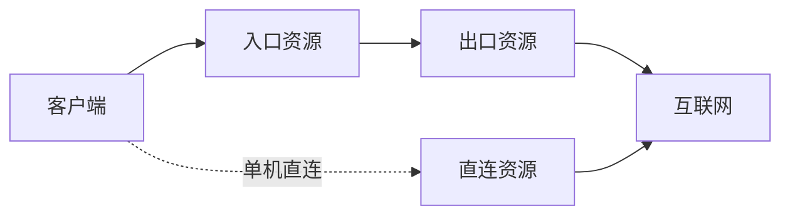

# 架构说明

## 控制路径

1. 管理员在控制面创建服务器、客户和链路草稿。
2. 编排器为每位客户生成独立凭据，并从各服务器端口池分配端口。
3. 转发线路为每位客户生成一个出口资源和一个或多个入口资源；单机直连只生成入口资源。
4. Agent 通过 HTTPS 主动轮询任务，控制面无需登录目标机。
5. Agent 把资源片段写入 `/etc/nexusgate/xray/resources/`，合并为完整配置。
6. Agent 运行 `xray run -test`；只有通过校验才替换生效配置并重启 Xray。
7. Agent 回报 Reality 公钥、任务结果、心跳、流量增量和 IP 观察。

## 数据路径

数据流量不经过控制面：

入口协议和链路传输协议使用独立适配器，因此无需相同。例如入口可以是 VLESS Reality Vision，而中转到落地使用 Shadowsocks 2022。

## 资源隔离

- 每个客户在每条链路中拥有独立 UUID 或密码。
- 每个资源使用唯一 inbound、outbound 和 routing tag。
- 入口资源只把对应 inbound 路由到对应出口 outbound。
- 出口资源只把对应 inbound 路由到独立 freedom outbound。
- 单机资源把对应 inbound 直接路由到独立 freedom outbound。
- Reality 私钥位于 `/etc/nexusgate/keys.json`，权限 `0600`。

## 故障行为

- 新配置校验失败：删除或恢复刚修改的资源片段，不切换运行配置。
- Xray 重启失败：恢复上一份完整配置并再次尝试启动。
- Agent 离线：控制面保留任务；运行任务租约超时后自动重试，最多 3 次。
- Agent 重新注册：撤销旧密钥，为该设备重新生成已有部署的对账任务。
- 任务失败：部署标记为失败、线路标记为异常，可只修复失败项或完整重建。
- 控制面离线：已运行的数据面继续工作，只有新配置和统计暂停。

## 存储

当前版本使用单个 JSON 数据文件和原子 rename。它减少了中小规模部署的依赖与维护成本。写入通过进程内队列串行化，不适合多个控制面实例共享写入；需要主动—主动高可用时应迁移到后续 PostgreSQL 存储。
