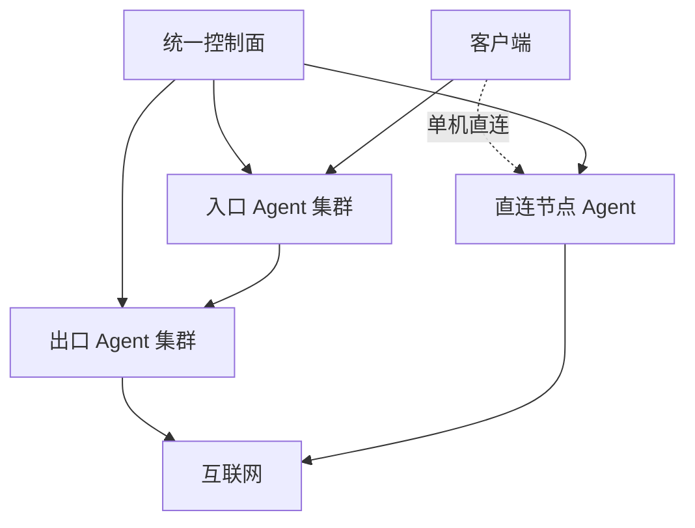

# NexusGate（枢门）

面向多入口机、多出口机和多客户场景的轻量集中编排面板。一个控制面统一管理设备、客户额度、转发线路、单机节点、部署任务和客户端链接，不再逐台打开不同面板维护。

> 当前版本：`v0.6.8`。请先在测试设备验证实际连接、客户端兼容性、云安全组和系统防火墙，再迁移业务。

**v0.6.8 资源优化：** 空任务轮询、心跳和无采样流量报告不再每次重写控制面整份数据库，真实流量与任务仍持久保存；数据文件改用紧凑 JSON。Agent 每 30 秒上报可用内存、系统盘余量及负载，服务器页面提示资源不足。节点日志改为独立的每小时检查，20 MB 提前轮转，最多 7 份压缩日志；更新 Agent 会迁移旧的每日轮转配置。控制面和入口、出口 Agent 都需更新。心跳与无采样诊断暂存在内存，异常重启后最迟下一次心跳恢复；真实流量计量仍落盘。

**v0.6.7 HY2 修复：** Xray 26.3.27 要求 HY2 传输使用 `network`，用户列表使用 `clients`；此前 Agent 生成 `method` 和 `users`，配置语法校验虽能通过，实际上无法建立 HY2 UDP 入口与认证账户。更新后的 Agent 会把已经保存的 HY2 资源转换为兼容配置，保留原端口、密码和订阅链接，并检查 UDP 端口是否真正由 Xray 监听；`ng-agent doctor` 也会显示协议与监听结果。面板机运行 `ng update`，每台 HY2 入口机运行 `ng-agent update`，然后运行 `ng-agent doctor` 检查。现有 HY2 线路无需删除重建；若端口已被其他程序占用，需处理冲突并再次运行 `ng-agent update`。云安全组仍需放行相应 UDP 端口。CI 对 Xray 26.3.27 与 sing-box 的 HY2 握手、HTTP 往返和双向计数运行真实测试。

**v0.6.6 修复：** 控制面记住入口进程最近退出的计量周期，忽略重载后才到达的旧上报，避免双向流量重复扣额。Agent 在解析入口计数失败时会阻止配置重载，并保留正在运行的资源供排查；证书安装和自动续签触发核心重启前，也先尝试上报当前计数。过期的节点 IP 观察记录会随后台清理删除，避免长期堆积。Clash 线路名与内置策略组或 `DIRECT` 撞名时才添加“(节点)”区分，其余线路保持原名。

**升级到 AnyTLS：** 面板机运行 `ng update`，入口设备运行 `ng-agent update && ng-agent engine install`。尚无有效证书时再在入口机运行 `ng-agent cert`，按提示输入域名与验证方式；已有有效证书无需重新申请。sing-box 仅在 AnyTLS 入口安装，普通入口和出口不构建 Go 引擎；Agent 更新不会重复编译 sing-box。执行 `ng-agent doctor` 确认引擎和证书已就绪，然后部署 AnyTLS 线路并开放入口 TCP 端口。AnyTLS → VLESS TCP 可以部署，但第二段未加密；跨公网推荐选择 SS2022 出口传输。

**v0.6.5 修复：** HY2 加入同一客户的 Clash 订阅时，`alpn` 列表现在生成为合法 YAML；旧订阅链接无需重置，面板更新后客户端重新拉取即可。节点显示线路名称；已有链接在订阅返回时也会改成当前线路名，多入口重名时仅附加序号。部署列表显示实际已应用协议及每个入口自新版计量开始的上行、下行，用来区分已保存但未应用的协议编辑。流量仍按客户端入口的上行＋下行累计；新增节点或重载前，Agent 先上报旧进程的最终计数，同一进程周期的迟到旧样本不再重复扣额。Speedtest 的结果不能单独证明该流量经过了指定代理节点。侧边栏“安装与命令”按面板、入口、出口分类提供复制命令；AnyTLS 独占机器会停止空闲 Xray，logrotate 每日保留最多 7 份、每次检查时按 20 MB 轮转，sing-box 构建缓存会在结束时删除。`ng update` 的自动回滚备份保留最近 5 份，手工备份不受影响。

若 v0.6.3 曾在 `go mod tidy` 阶段报 `nexusgate/statsquery/gomod/... should not have @version`，升级到 v0.6.4 后在该入口机运行 `ng-agent engine install` 即可重试；证书已验证时不用重新申请，已有 Xray 线路也无需重建。安装器现在把 Go 缓存与临时工具链放在统计组件模块目录外，并在 CI 中直接运行该安装器。

**从 v0.5.2 续额恢复：** 面板机运行 `ng update`。以后额度用尽而自动暂停时，调高上限或流量清零会自动排队恢复原资源，入口和出口都确认后订阅才重新返回节点；已导入客户端无需更换链接。升级前已经显示“运行中”但线路是“草稿”的历史状态无法可靠区分手动停用，在“转发与节点”点击该线路的“恢复原节点”一次；若原端口已被占用，会提示改用“全新部署”。本次是控制面更新，入口 Agent 已为 v0.5.2 时无需重装。Reality 私钥仍需保存在原 Agent 上；如果机器已重装并丢失密钥，恢复后的节点公钥会变化，应刷新订阅。

## 核心模型

NexusGate 把管理面与流量面分开。客户流量不会经过控制面，控制面只负责把期望配置下发给各设备 Agent。



- **转发线路**：一台或多台入口设备 → 一台出口设备；客户端协议与入口到出口传输协议可以不同。
- **单机直连**：无需出口设备，直接在选定设备创建客户端节点。
- **Agent 主动连接**：控制面不保存各设备的 SSH 密码。
- **一条线路统一维护**：编辑、修复、停用、重建不再分别操作每台服务器。

## 当前已实现

- 默认明亮、可切换暗色的中文响应式 UI；登录页仅保留账号与密码，不显示业务介绍。
- 固定宽度侧栏与可阅读的横排导航：“概览、服务器、客户与订阅、转发与节点、部署与链接、安装与命令、设置与运维”。
- 设备、客户、线路均可创建后编辑；运行中线路修改后进入“待重新部署”。列表操作按行收纳，长列表不再因按钮换行变高。
- 线路表单中的入口设备和客户可搜索后多选，长列表在固定高度内滚动。
- 支持完整重建失败线路，以及只重试失败部署项。
- Agent 重装后自动撤销旧密钥、重新对账并恢复已有资源；首次心跳成功才提示安装完成。Xray 配置错误不会再让 Agent 控制通道退出；引擎状态和错误会显示在设备行。
- 部署前检查目标 Agent 最近心跳；即使核心服务报错，仍可下发修复资源，具体失败由任务日志返回。面板机可以兼任出口/单机节点，`ng update` 会同步升级本机已安装的 Agent。
- 任务 5 分钟租约、超时自动重试，连续 3 次失败才标记异常。
- 客户到期使用日期选择器、常用期限下拉和时间下拉，不要求手写日期格式。
- 客户独立凭据、流量额度、到期、滚动 IP 上限、用量清零及启停。
- 流量、到期或节点 IP 上限触发暂停后，会移除入口和出口资源以阻断已导入的节点。调整额度、续期或提高 IP 上限后，控制面自动按原端口和原凭据恢复；清理已开始时先等待清理完成，再下发恢复任务。客户手动停用后需要手动启用。旧版已被移除而变为草稿的线路，可在“转发与节点”点“恢复原节点”一次性找回原部署；若原端口已被别的线路占用，须全新部署并更新客户端。
- 流量额度为入口节点上行＋下行之和，转发出口不重复计费。Agent 分别查询 Xray 和 sing-box 的 JSON 双向累计计数；Xray 省略的零值字段按 0 处理；控制面按各部署的进程周期计算增量，重复请求不重复计费。Agent 升级后若配置相同且核心正常运行，不重启核心丢失内存计数。客户表显示上行、下行及最后计量时间，设备表显示统计错误；订阅头使用独立的 `upload` / `download` 字段。
- 客户列表显示滚动节点 IP 数与最近 24 小时的订阅客户端估计数；“访问”可查看节点 IP 首末上报时间和最近 100 条订阅请求（结果、来源 IP、User-Agent、格式、返回大小）。日志最多保留 30 天 / 全局 10000 条，可为单个客户清空订阅访问窗口。
- 订阅客户端估计上限会在订阅下载时按 `X-Device-ID` / `X-Client-ID` 或 User-Agent 限制新客户端。节点 IP 超限则由入口 Agent 访问日志上报后停用客户，出口收到的入口机 IP 不计为客户 IP。Agent 现在只有在观察记录成功送达控制面后才推进日志游标，临时网络失败可重试。
- Reality 私钥只在节点机生成；控制面只接收客户端公钥。升级时旧部署错误中的误报私钥会从历史记录中脱敏。
- Tesla、Amazon、Apple、Intel、AMD Reality 目标预设，也可自定义。
- IPv4、IPv6 和双栈监听；IPv6 客户端链接会自动使用方括号格式。
- JSON 在线备份/恢复，以及包含数据、环境和 Caddy 配置的迁移压缩包。
- 后台修改登录账号和密码；修改后强制重新登录。
- `ng` 运维菜单：升级、域名、证书、备份、恢复、管理员账号/密码、状态、日志、重启和卸载。
- 失败/未完成线路可从“线路”删除；尚未确认清理的节点资源保留隐藏记录与任务，设备重新上线后继续清理，避免遗留监听端口。
- 若离线设备永久损坏，可在删除关联线路后使用“强制遗忘”；这会放弃远程清理，因此仅限设备已销毁或已手工清除代理配置时使用。
- 线路删除后客户可立即删除；后台仍保留设备资源清理任务。设备登记需要等 Agent 清理确认，或在目标机卸载后对离线设备选择遗忘。
- 每客户独立随机订阅地址，支持 V2Ray、Shadowrocket、通用 Base64、Mihomo/Clash 简洁版和智能分流版、sing-box JSON、Surge 兼容节点及原始 URI；二维码在浏览器本地生成。可重置地址，只分发已成功部署的节点，停用/到期/流量用尽时拒绝分发。
- 入口/出口 Agent 可以在目标机通过 `ng-agent uninstall` 卸载专属服务、配置和密钥；控制台删除登记会撤销其访问资格。
- Agent 支持 Debian/Ubuntu、RHEL 系 systemd，以及 Alpine OpenRC。
- Agent 访问与错误日志由 logrotate 每日检查、最多保留 7 份，达到 20 MB 也会轮转；订阅访问记录仍按控制面 30 天/全局 10000 条清理。
- 节点证书一键申请：入口机运行 `ng-agent cert`，输入域名（邮箱可选）；优先选 CF DNS 验证或有公网 80 端口时选 HTTP，设置续签、检查证书并把域名同步到该设备。CF Token 在安装 Certbot DNS 插件前验证，仅 root 可读；面板部署前确认入口 Agent 已上报证书状态。
- 轻量节点安装只装 Xray 和 Node Agent；需要 AnyTLS 时在对应入口机按需安装 sing-box。临时 Go 编译缓存随安装结束清理，证书心跳复用未变化证书的验证结果。已有运行中的 AnyTLS 不受按需安装规则影响。

## 协议矩阵

| 用途 | 协议 | 状态 |
| --- | --- | --- |
| 客户入口 / 单机节点 | VLESS + Reality + Vision | 可部署 |
| 客户入口 / 单机节点 | VLESS + Reality | 可部署 |
| 客户入口 / 单机节点 | VLESS + WebSocket（无 TLS） | 可部署，建议仅配合可信网络或外层 TLS |
| 客户入口 / 单机节点 | VLESS + WebSocket + TLS | 可部署；入口设备需填写 TLS 域名并安装有效证书 |
| 客户入口 / 单机节点 | Hysteria 2 | 可部署（测试阶段）；入口证书、UDP 入站端口和新版 Xray 必需 |
| 客户入口 / 单机节点 | AnyTLS | 可部署（测试阶段）；入口证书、TCP 端口和带统计接口的 sing-box 必需 |
| 客户入口 / 单机节点 | VMess + WebSocket（无 TLS） | 可部署，兼容模式 |
| 客户入口 / 单机节点 | Shadowsocks 2022 AES-128 / AES-256 | 可部署 |
| 客户入口 / 单机节点 | Shadowsocks AES-128-GCM / AES-256-GCM | 可部署 |
| 客户入口 / 单机节点 | SOCKS5 用户密码 | 可部署，仅建议可信网络或外层隧道 |
| 入口 → 出口 | 上述四种 Shadowsocks | 可部署 |
| 入口 → 出口 | VLESS TCP | 可部署，建议可信网络或外层隧道 |
| 入口 → 出口 | SOCKS5 用户密码 | 可部署，仅建议可信网络或外层隧道 |

Hysteria 2 复用当前 Xray Agent 的任务、统计及出口路由。AnyTLS 由单独的 sing-box 服务承载，使用自己的统计接口及经认证连接日志；两者与 VLESS WS TLS 均需入口证书。Hysteria 2 使用所选端口的 **UDP**，AnyTLS 和 VLESS WS TLS 使用 **TCP**。AnyTLS 是独立协议，不是 VLESS 的扩展。

### Cloudflare 域名和节点证书

1. 在 CF 添加指向**入口设备公网 IP** 的节点子域名 A/AAAA 记录，例如 `node.example.com`，将节点记录设置为 **DNS only（灰云）**。橙云的普通 HTTP 代理不会透传 Hysteria 2、AnyTLS 等自定义 TCP/UDP 端口。
2. 首次安装 Agent 后，直接在**入口设备 SSH** 运行：

   ```bash
   ng-agent cert
   ```

   旧 Agent 可用一行命令完成升级并进入申请：`ng-agent update && ng-agent cert`。输入节点域名；邮箱可以留空（留空则无到期邮件）。默认 CF DNS-01，首次隐藏输入一次 **My Profile → API Tokens → Edit zone DNS** 模板创建的 Token，仅授予相应 Zone 的 `Zone:DNS:Edit`；输入后先向 Cloudflare 验证，有效才保存到 `/etc/nexusgate/cloudflare/` 供续签。不要粘贴 Global API Key 或整条 `curl` 命令。若选择 HTTP-01，无需 Token，但 DNS 灰云必须指向此机，公网须放行 80/TCP；本地端口空闲并不能证明公网可达。没有公网 80 或 CF Token 时，单凭域名无法完成受信任证书的自动签发。

3. 成功后自动设置每日续签、重启运行中的节点引擎，并同步“服务器”的 TLS 域名；等待约 30 秒刷新设备列表，确认显示“节点证书 · 已确认”。DNS-01 不占用 80/TCP。只有入口需要申请；单纯出口不需要。节点使用的 TCP/UDP 端口仍须放行。

已有受信任证书可运行 `ng-agent cert import 域名 /path/fullchain.pem /path/privkey.pem`；手动导入的证书需要自行管理续签。非交互调用可用 `ng-agent cert issue 域名 邮箱` 或 `ng-agent cert issue-cloudflare 域名 邮箱 /root/cloudflare.ini`。用 `ng-agent cert status 域名` 检查证书。若发行版无法安装 CF 插件，请参照 Certbot 文档安装后重试。

先运行 `ng-agent update` 升级旧 Agent，再申请证书。完成后在“转发与节点”点击“修复失败项”；不必删除客户、重新注册节点或改变面板的 HTTPS 域名。

Reality 默认目标/SNI 为 `www.tesla.com:443`，也可选 Amazon、Apple、Intel、AMD 或自定义。目标必须实际接受所选 SNI，预设本身不是防共享或防盗用手段；访问控制依赖每客户随机 UUID、shortId 等凭据。

> “订阅客户端估计上限”只限制新的订阅下载：同一 User-Agent 可能是多台设备，同一设备也可能换 User-Agent，`X-Device-ID` 可以被客户端自行更改。无法凭共享节点链接可靠限制物理设备，必须另做每设备凭据签发与撤销。节点 IP 统计来自 Xray 访问日志或 sing-box 已认证连接日志，约每分钟上报一次、滚动 10 分钟；部分 UDP-only 流量可能不出现在访问日志，故不能保证精确实时 IP 上限。超限后目前是停用整个客户并排队移除其部署。订阅令牌重置只阻止再下载；已导入的节点凭据须停用或重建线路后才能撤销。

Hysteria 2、VLESS WS TLS 和 AnyTLS 都依赖 TLS。可以不用公网 CA 而改用自签证书，但服务端仍须有证书，客户端须导入或固定证书指纹；NexusGate 当前只自动配置受信任证书路径，不会生成自签节点订阅。无需节点证书时可使用已支持的 VLESS Reality。

“AnyTLS + VLESS”表示两段链路：客户端以 AnyTLS 接入入口机，再由入口机以 VLESS TCP 连到出口机。入口 Agent 管理 sing-box 服务、证书、统计、已认证来源 IP、失败回滚与清理；出口仍由 Xray 管理。自建 sing-box 使用固定的 1.12.23 版本和 `with_v2ray_api` 编译标签。节点 URI 被复制后仍可被使用，协议本身不会阻止共享；每设备凭据与单设备撤销尚未实现。

**引擎取舍：** 保留 Xray 现有部署并增加 sing-box AnyTLS 入口，避免替换旧资源导致端口和 Reality 密钥变化。AnyTLS 可转发到 SS2022、SS、VLESS TCP 和 SOCKS5 出口；跨公网优先使用加密的 SS2022。新节点仍须在目标 VPS 上进行真实客户端连接与双向计数验证，自动化配置测试不能替代真实网络测试。

如果 Clash Verge 显示“系统代理已关闭”，普通浏览器测速和播放视频可能走本机直连，节点统计仍为 0 B。测试时开启系统代理或 TUN，手动选定节点并确认客户端连接日志，再等待 Agent 一次上报（约 60 秒），刷新客户列表与客户端订阅。入口机 `ng-agent doctor` 会显示 Xray 原始入站双向计数和查询错误；若节点有连接而计数仍为空，请先检查当前设备的统计状态和 Xray 配置。Clash 智能分流模板提供 Meta 服务独立策略组，可针对 Facebook、Instagram 和 WhatsApp 选择同一出口的不同节点对比；分流规则本身不能保证速度提升。

额度停用在下一次上报与后台巡检后执行，测速或短时大流量可能暂时超过额度；Xray 异常重启、节点下线或删除前尚未上报的内存计数也可能丢失。本版统计适合运营额度，不是实时硬限速或精确计费账本。若客户此前始终显示 0 B，旧流量不会在升级后自动补算；从新版 Agent 首次成功上报开始核对。

## 安装控制面

准备一台 Debian 12 或 Ubuntu 22.04/24.04 VPS，把面板域名的 A/AAAA 记录解析到它，并放行 TCP 80、443：

```bash
bash <(curl -fsSL https://raw.githubusercontent.com/a2899882/NexusGate/main/scripts/install.sh)
```

非交互安装：

```bash
bash <(curl -fsSL https://raw.githubusercontent.com/a2899882/NexusGate/main/scripts/install.sh) \
  --domain gate.example.com --email admin@example.com
```

安装器会部署 Node.js、Caddy、systemd 服务，启用自动 HTTPS，并输出首次登录密码。

登录后的顺序：

1. 在“服务器”添加入口、出口或综合节点。
2. 点击“注册 / 重装”，复制一次性命令到目标 VPS 以 root 执行。
3. 在“客户与订阅”创建客户。
4. 在“转发与节点”选择转发线路或单机直连，选择协议、设备、客户和端口策略。
5. 点击部署，在“部署与链接”复制单条客户端链接，或在“客户与订阅 → 订阅链接”获取各客户端订阅和二维码。

订阅 URL 属于凭据；请经 HTTPS 私下交付。自动识别格式根据客户端 User-Agent 返回 Clash/Mihomo 或 Base64；识别不准时使用固定格式。智能分流包含广告拦截、国内直连、AI/流媒体分组和自动延迟选择；客户端需要可用的 Mihomo geodata。Surge 格式只导出它支持的 SS、SOCKS5 和 VMess 节点；若无兼容节点则返回错误。sing-box JSON 是本机 127.0.0.1:2080 混合入站配置，可能与已有监听端口冲突。自定义订阅模板和可靠的一设备一凭据仍待开发。

> 云安全组和系统防火墙必须放行实际使用的 TCP/UDP 端口。默认端口池为 `20000–50000`，生产环境建议按设备缩小范围。

### Alpine Agent

Alpine 首次执行前如果没有 Bash：

```sh
apk add --no-cache bash curl
```

然后运行面板生成的同一条注册命令。安装器会自动使用 OpenRC。

## 升级

控制面一键升级会先自动备份，再下载 GitHub `main` 分支并执行健康检查：

```bash
ng update
```

旧版 Agent 可保留当前注册密钥原地升级：

```bash
curl -fsSL https://raw.githubusercontent.com/a2899882/NexusGate/main/scripts/agent-update.sh | bash
```

新安装的 Agent 以后直接运行：

```bash
ng-agent-update
ng-agent uninstall         # 新版 Agent 在目标机交互卸载
ng-agent doctor            # 检查心跳、Xray 配置、服务及最近错误
ng-agent cert              # 交互式申请、续签并同步面板
ng-agent cert issue node.example.com admin@example.com
ng-agent cert issue-cloudflare node.example.com admin@example.com /root/cloudflare.ini
ng-agent cert import node.example.com /path/fullchain.pem /path/privkey.pem
ng-agent cert status node.example.com
```

如果某台设备已出现“上线后又离线”，先在该机运行 `ng-agent doctor`，核对控制面连通性、Xray 配置错误和服务日志。然后更新 Agent；必要时在控制面重新生成“注册 / 重装”命令并执行。注册后首次心跳失败会明确报错。

老 Agent 没有 `ng-agent` 命令时，先运行 `ng-agent-update`，或在目标机运行：

```bash
curl -fsSL https://raw.githubusercontent.com/a2899882/NexusGate/main/scripts/agent-uninstall.sh | bash
```

卸载仅删除 NexusGate 专属的 Agent/Xray 服务、`/etc/nexusgate` 配置与密钥、Agent 程序和日志。共用的 Node.js 和 `/usr/local/bin/xray` 不会被自动删除。卸载后回控制台删除设备；如果之前的清理任务尚未确认且设备已离线，用“遗忘离线设备”撤销登记。控制台遗忘不能远程删除旧机器资源。

## `ng` 管理菜单

```bash
ng                         # 交互菜单
ng update                  # 备份、升级、健康检查
ng domain new.example.com  # 更换面板域名
ng cert                    # 校验 Caddy 并检查证书日志
ng backup                  # 生成 /root/nexusgate-backup-*.tar.gz
ng restore /root/文件.tar.gz
ng account                 # 交互修改当前管理员账号和/或密码
ng account oldname         # 指定旧账号；ng password 为兼容别名
ng status
ng restart
ng logs 200
ng uninstall               # 确认后先备份再卸载
```

Caddy 会自动申请和续签证书，不需要定时手工续签；`ng cert` 用于校验配置、重新加载并查看最近证书日志。

## 容灾迁移

NexusGate 当前是单控制面、冷备恢复模型，不支持两台控制面同时写同一个 JSON 数据库。

1. 提前降低面板域名 DNS TTL。
2. 在旧控制面执行 `ng backup`，下载 `/root/nexusgate-backup-*.tar.gz`。
3. 在新 Debian/Ubuntu 服务器安装 NexusGate，使用原面板域名。
4. 把压缩包上传到新服务器 `/root`，执行 `ng restore /root/文件名.tar.gz`。
5. 把 Cloudflare/DNS 的 A/AAAA 记录改为新服务器 IP，并确保 80/443 放行。
6. Caddy 获取证书后，各 Agent 仍连接同一域名，会自动恢复上报；无需逐台更改控制面地址。

迁移包包含：控制面数据库、登录/运行环境配置和 Caddy 站点配置。恢复前系统还会在 `/root` 自动再生成一份安全快照。

## 配置建议

控制面不承载客户流量，主要消耗来自 Agent 心跳、任务和统计写入。

| 规模 | 建议控制面配置 | 说明 |
| --- | --- | --- |
| 测试 / 20 台以内 | 1 vCPU / 1 GB / 20 GB SSD | 可运行，不建议承担关键业务 |
| 约 40 台节点、数百客户 | 2 vCPU / 4 GB / 40 GB SSD | 推荐起点；留出 Caddy、备份和 JSON 整库事务的余量 |
| 100 台以上 | 4 vCPU / 8 GB / 80 GB SSD | 需要先做实际压力测试；高频计费写入建议迁移到数据库与任务队列 |
| 更大规模或多管理员高频操作 | PostgreSQL/队列版 | 当前 JSON 单机版不建议继续横向放大 |

以约 10 台入口/中转、30 台落地、每台入口登记 10–30 人但并不同时在线为例：

| 机器 | 可先试用 | 更稳妥的生产起点 | 注意 |
| --- | --- | --- | --- |
| 入口/中转 | 1 vCPU / 1 GB / 10 GB | 2 vCPU / 2 GB / 20 GB | 1 GB 仅限低并发试运行；HY2 UDP、AnyTLS、测速峰值和多协议并存时优先升级 |
| 落地/出口 | 1 vCPU / 1 GB / 10 GB | 2 vCPU / 2 GB / 20 GB | 合并多条线路时看同时连接数和出口总带宽；只需 Xray 的节点不安装 sing-box |

这些是部署起点，不是“每台保证 30 人同时在线”的容量承诺。实际瓶颈常是 VPS 的共享 CPU、出入站带宽、服务商连接数限制、UDP 质量或端口安全组；应按最忙的时段观察服务器页面的可用内存/磁盘和负载，实测并发与吞吐后逐台扩容。若剩余内存持续低于 200 MB、系统盘低于 1 GB、1 分钟负载持续高于 vCPU 数，或出现 OOM、丢包与超时，就应分散线路或升级。面板不转发客户数据，40 台 Agent 空闲时约每秒 5 次任务轮询、每秒 1.3 次心跳；v0.6.8 的空轮询不再写盘，真实流量报告和客户订阅访问仍会持久化。

节点日志每小时检查一次，超过 20 MB 提前轮转并保留 7 份；系统的 journald 有独立配额，仍需按发行版检查。`ng-agent doctor` 查看引擎/统计，`systemctl status nexusgate-agent-logrotate.timer` 查看轮转定时器。首次安装 AnyTLS 的 sing-box 统计构建需要 Go 编译资源和临时磁盘；1 GB 机器建议在有临时 swap 或更大内存的维护窗口进行，构建缓存完成后删除。控制面更新前自动备份保留最近 5 份，手动备份和恢复前快照由管理员自行归档清理。

## 轻量与安全设计

- 控制面和 Agent 均无 npm 运行依赖，只要求 Node.js 18+。
- Agent API Key 使用指纹快速定位，再用 scrypt 校验，避免大量心跳反复全表执行慢哈希。
- 数据文件、备份和 Agent 环境文件默认权限为 `0600`。
- 登录 Cookie 为 HttpOnly、SameSite=Strict，HTTPS 下启用 Secure；写操作需要 CSRF Token。
- Xray 配置先执行 `run -test`，通过后才原子切换；失败会回滚资源文件。
- Agent 重启会从持久化资源目录重建完整 Xray 配置。
- 仅在你有权管理的服务器和网络上使用，并遵守所在地法律和服务商政策。

更完整的说明见 [架构](docs/ARCHITECTURE.md)、[安全模型](docs/SECURITY.md) 和 [路线图](docs/ROADMAP.md)。

## 本地开发

```bash
export NG_ADMIN_PASSWORD='change-this-password'
export NG_COOKIE_SECURE=false
npm test
npm start
```

打开 <http://127.0.0.1:8787>，默认账号为 `admin`。

## 许可

[MIT](LICENSE)。NexusGate 不打包或重新许可 Xray-core；Agent 安装器从 Xray 官方 Release 下载独立二进制。
